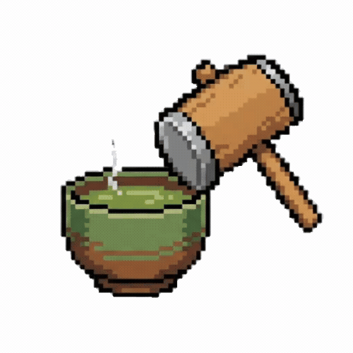

<!-- # プロダクト名 -->
<!-- あれちゃう？知らんけど。 -->
<!-- プロダクト名に変更してください -->

<!--  -->

<!-- プロダクト名・イメージ画像を差し変えてください
# チーム名
## チーム10 一汁三菜
-->

<!-- チームIDとチーム名を入力してください -->

# プロダクト名

<!--
  誰の、どんな "欲しい" に焦点を当てたかおしえてください。
  # チーム名
  # キャッチコピー
-->
## チーム名
チーム10 一汁三菜
## キャッチコピー
答えられへんねんやったら、一緒に茶でもしばきにいきましょか^^

# 1. プロダクト概要

## どんな「本当に欲しい」に着目したか

<!--
  誰の、どんな "欲しい" に焦点を当てたかおしえてください。
-->

就職等で関西を離れてしまう人が，離れても関西の思い出や雰囲気を思い出したい

## どんなアプローチで「本当に欲しい」を実現しましたか？

<!--
  プロダクトが実現したアプローチや価値についておしえてください。
-->

関西人の言葉遣いを用いたクイズやストーリーを楽しめるWebアプリケーション

---

# 2. プロダクトの機能

<!--
  このプロダクトが持つ機能について、できるだけ詳しくおしえてください。
-->

関西人がチャット形式で関西ノリであるお題について説明する

ユーザはお題を推測し、解答を送信して正誤判定を行う

## 過去の面白かったチャットを見ることができるので、クイズに参加しなくても、関西人ノリを体験することができる

# 3. 使い方・デモ

<!--
  このプロダクトが使われるシーンや、具体的な使い方、動作イメージなどをおしえてください。
  必要であれば、画像・動画・GIFなどを利用しても構いません。
-->

クイズをするモードと高評価のストーリーを閲覧するモードがある

クイズモード
ローディング画面では関西人あるあるが表示されている

関西人が何かの話題について話し合っている
この会話に参加したユーザは2人の関西人が何について話しているのかをチャットで送信する

正解なら、お気に入り登録をするのか、もう一度遊ぶかを選択することができる
不正解なら関西人の会話がそのまま続くので、お題が何かユーザが考え続ける

---

# 4. 技術面でのこだわり

<!--
  プロダクトについて、技術選定の理由や、今回チャレンジした技術、難しかった点など、
  技術面でのこだわりや挑戦の内容をおしえてください。
  名前は最後に消した方がいいかも
-->

## バックエンド

### 🏗️ 3層アーキテクチャ（Controller / Service / Repository）

- **責務の分離とDI**:
  各層の責務を明確に分離し、インターフェースで接続することで依存性を注入（DI）している。Controller層はHTTPリクエストの受付・レスポンス返却、Service層はビジネスロジック、Repository層はDBアクセスを担当。

### 🤖 Gemini API 連携

- **プロンプト調整**:
  京都人と大阪人のキャラ付け、前半→中盤→終盤で難易度が段階的に下がるヒント構成など、クイズとして成立するよう細かく指示を設計。
- **JSON構造化出力**:
  レスポンスのMIMEタイプとJSONスキーマを指定することで、Gemini の出力を確実にパース可能な JSON 形式に制約。
- **生成パラメータの調整**:
  毎回異なるお題・会話が生成されやすいように生成パラメータを設定し、ランダム性を高めつつ日本語として破綻しないラインを狙った。

### ✅ 答え合わせの仕組み

- **表記ゆれを網羅した正解判定**:
  事前に想定される正解を、漢字・ひらがな・カタカナ・英語・略称など考えうる表記ゆれを含めて複数パターン用意し、いずれかに一致すれば正解と判定。ただしユーザに提示する正解表示は代表的な1つのみとし、シンプルな体験を保っている。

### 🔒 簡易的な不正対策

- **答え取得までの時間制限**:
  ログイン機能を実装しない構成の中で、ゲーム開始から一定時間（90秒）が経過するまでは答えを取得できないようにした。APIを直接叩いて即座に答えを見るような行為を防ぐ、簡易的なセキュリティ対策として実装した。

### ⚠️ エラーハンドリング

- **型によるエラー判定**:
  エラーを独自の型として定義し、型によってエラーの種別を判定している。文字列比較に頼らないため、エラーメッセージの変更に対応しやすくした。Controller層ではエラー種別に応じて適切なHTTPステータスコード（400 / 403 / 404 / 500）を返し分ける。

---

## インフラ

  

### セキュアなネットワーク設計（VPC/Subnet分割）
ただEC2を立てるだけでなく、実務で標準とされるセキュアな構成を採用。
**プライベートサブネットの活用:** アプリケーション（EC2）とデータベース（RDS）をインターネットから直接見えない「プライベートサブネット」に配置し、外部からの直接攻撃を遮断。
**踏み台サーバー（Bastion）の導入:** 開発者のメンテナンス用アクセスは、パブリックサブネットに配置したBastionサーバー経由のみに限定し、セキュアな運用経路を確保。
**ALBによるアクセス集約とSSL化:** リクエストの受け口をApplication Load Balancer (ALB) に集約し、AWS Certificate Manager (ACM) と連携して安全なHTTPS通信（SSL終端）を実現。

### GHCRを活用したEC2への負荷が少ないCI/CD
**ビルド処理のオフロード:** リソースの限られたEC2インスタンス（t2.micro等）内で直接 docker build を行うとメモリ不足（OOM Killer）でフリーズするリスクがある。これを回避するため、ビルド処理をGitHub Actionsの強力なサーバーに委譲した。

**GHCR (GitHub Container Registry) の採用:** GitHub Actionsでビルドした完成品のDockerイメージをGHCRにPushし、EC2側はそれを docker pull するだけの「超軽量なデプロイ」を実現。デプロイ時間の短縮とサーバーの安定稼働を両立した。

# 5. UI/UX面でのこだわり

<!--
  UIやUXのデザインの面で、工夫したこと、挑戦したことなどがあればおしえてください。
  板垣君or丹羽君
-->

### 🏎️ ロード画面

- **関西あるあるのランダム表示**:
  APIからのデータ取得待ち時間を、関西にまつわる「あるあるネタ」を表示することで、ユーザーを飽きさせない工夫。

### 🎮 ゲーム中

- **チャット形式の直感的なUI**:
  親しみやすいメッセージバブルを採用し、京都人と大阪人が交互にヒントを出す演出をアイコンの使い分けで表現。
- **ヒントの自動配信とタイマー**:
  一定時間ごとに新しいヒントが流れてくる臨場感を演出。タイマーにより次のヒントまでの時間を可視化。
- **スマート自動スクロール**:
  新しいメッセージ追加時、画面下部にいる時のみ自動スクロール。過去のやり取りを見返している最中に勝手にスクロールされないよう配慮。
- **自然なギブアップ誘導**:
  全てのヒントが出切った後、チャットの流れの中に「答えを見る？」というボタンを表示。ゲームの流れを止めずに次のアクションへ誘導。

### ✨ 正解後の挙動

- **物語の完全公開（アコーディオン）**:
  正解後、「物語の続きを見る」をクリックすることで、クイズ中に出てこなかった残りの会話を全て読むことができ、ストーリーを最後まで楽しめる。
- **「茶しばき（お気に入り）」機能**:
  面白いと思ったチャットには、関西ならではの「茶しばき（お茶しに行こう）」という言葉でお気に入り登録が可能。

  

    
  

- **𝕏（Twitter）でのシェア**:
  クイズの結果や面白い会話を、𝕏（旧Twitter）ですぐにシェアできる機能を搭載。
- **状況に応じたアイコンの変化**:
  正解なら「大阪」、不正解なら「京都」のアイコンを表示するなど、判定結果が視覚的に即座に伝わるよう工夫。

### 📑 高評価のストーリー

- **チャット形式のカードプレビュー**:
  一覧画面（掲示板）では、各物語の冒頭部分をチャット形式のままプレビュー表示。クリックする前から内容の雰囲気が直感的に伝わるデザイン。
- **「タップで回答確認」の段階的公開**:
  詳細画面では、あえて答えを最初から表示せず、ユーザーが自らタップして確認する仕様を採用。過去の良問を自分でも解いてみるという楽しみを残す。
- **没入感のあるフルスクリーン閲覧**:
  余計な UI を排除し、会話の流れに集中できるレイアウトを採用。チャットアプリを使っているかのような感覚でストーリーを読み進められる。

### 🎨 その他

- **モバイルファーストのレスポンシブデザイン**:
  スマートフォンでの操作をメインに想定しつつ、PCでも快適にプレイできる柔軟なレイアウトを実現。
- **視覚的な導線設計**:
  「ゲームスタート」などの主要ボタンは目立つオレンジ色、サブボタンは白など、機能の重要度に応じたカラー設計。
- **Material Designによる統一感**:
  一貫性のあるデザインシステム（MUI）を採用し、全体として清潔感とプレミアム感のある外観を実現。

  [使用例のストーリーはこちら](https://youtu.be/Kf5yTqowlrI)   
  [紹介動画はこちら]()

---

# 6. 将来の展望

<!--
  今回実装しきれなかったが、今後実装するとよりユーザに価値が届けられそうな機能など、
  今後の展望があればおしえてください。
-->

・対戦機能を付けて複数ユーザが同時に楽しめるようにする

・ログイン機能を追加することで，自身がいいねしたストーリーを振り返れるようにしたり，高評価順にストーリーを閲覧できる機能を追加する．コメント機能を追加しても面白い．

・様々な地方の登場人物を追加

・IDをUUIDを用いて生成するように変更する

・事前にAI生成ストーリーを用意しておき、レスポンスを早くする．用意したストーリーのストックが少なくなってきたら自動で生成する．

---

<!-- この下は元から記入されていたもの
上の分は今年の評価基準らしいので、基本的には上の部分を修正した方がいいと思う

## 背景・課題・解決されること
 -->

<!-- テーマ「関西をいい感じに」に対して、考案するプロダクトがどういった(Why)背景から思いついたのか、どのよう(What)な課題があり、どのよう(How)に解決するのかを入力してください

## プロダクト説明
-->

<!-- 開発したプロダクトの説明を入力してください 

## 操作説明・デモ動画
-->

<!-- 開発したプロダクトの操作説明について入力してください。また、操作説明デモ動画があれば、埋め込みやリンクを記載してください 

## 注力したポイント
-->

<!-- 開発したプロダクトの中で、特に注力して作成した箇所・ポイントについて入力してください

### アイデア面

### デザイン面

### その他

## 使用技術

-->

<!-- 使用技術を入力してください 

### AWS構成図

-->

<!--
markdownの記法はこちらを参照してください！
https://docs.github.com/ja/get-started/writing-on-github/getting-started-with-writing-and-formatting-on-github/basic-writing-and-formatting-syntax
-->
